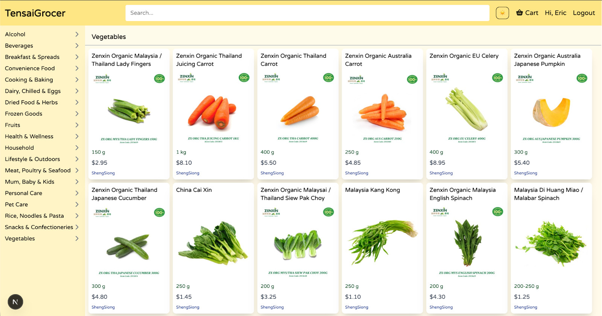

# TensaiGrocer

[Browse it here](https://tensaigrocer.vercel.app) 

This is a project created as an exercise to learn about NextJS, MongoDB, TailwindCSS etc. 

Features :
- MongoDB backend for groceries and users data.
- Responsive design of Navbar and Sidebar.
- Incremental loading of Categorized items.
- Indexed data for item searching.
- Incremental loading of Search results.
- Users signup, login modal form with validations.
- Users login using JWT verification.
- UseAuth Context
- c,r,u,d operations for Users.

## Credits
Groceries Data scraped from:
- shengsiong.com.sg
- fairprice.com.sg

